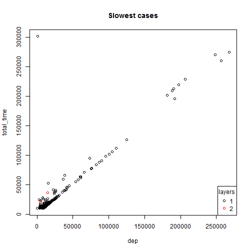
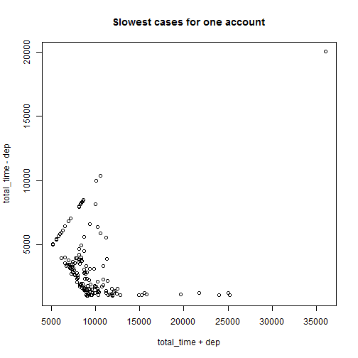
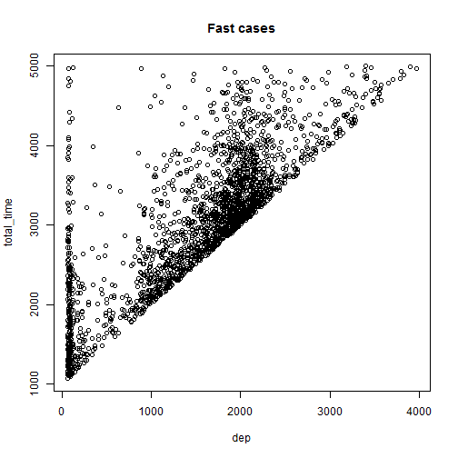

## About

This is about an R app hosted on [Shiny](https://bbbush.shinyapps.io/dss-devdataprod-20160620/), which presents a few data points collected in calculating an account.

## What is an account
When people trade stocks, an account is used to bookkeeping. An account in code is also used to represent any mixture of securities, get included in another account. The result is a recursive structure.

## Data introduction

```
##   layer  id total_time sub_sec_cnt sub_acc_cnt  dep MERGE
## 1     1 633       3096          10           0 1852    12
```
- layer: 1 for top layer, increase 1 for each sub layers
- total_time: collected by performance counter
- sub_sec_cnt: how many securities held (non-account only)
- sub_acc_cnt: how many account held
- dep: also collected by performance counter
- MERGE: also collected by performance counter

## Data introduction (cont.)

The total_time is roughly equal to dep, as MERGE is usually fast. Another part of slowness comes from handling securities and accounts in sub layers, which cannot be measured effectively, but should have something to do with the number of holdings.

## Slow cases

For slow ones (more than 10s), they are mostly caused by dep alone


## Slow cases (one account)

That is not true for an account that has been repeatedly tested



## Fast cases (one account)

That is not true when looking at fast cases either


